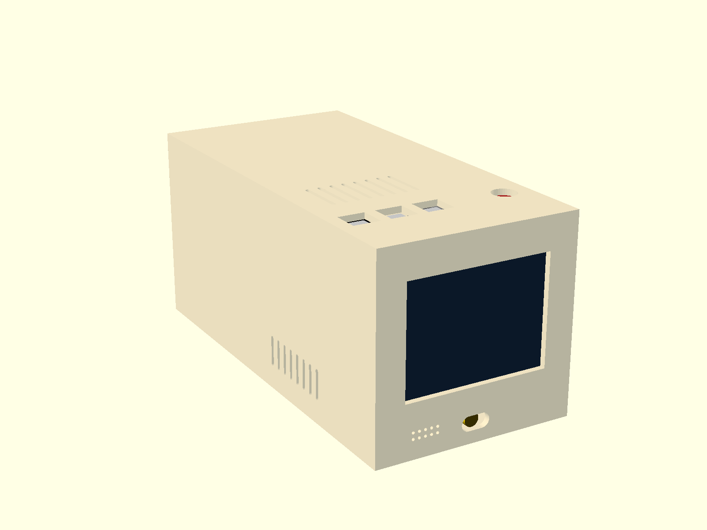
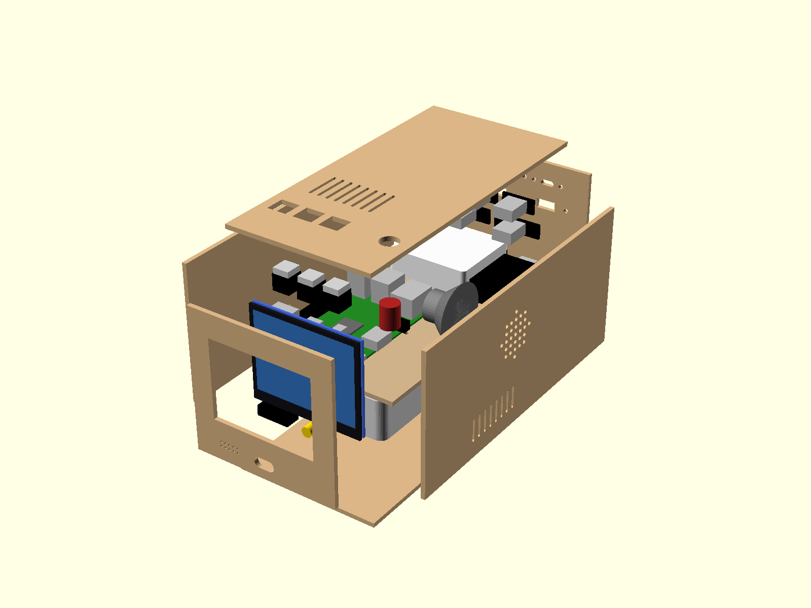

# Bot enclosure (phase 1)

A parametric enclosure for the desktop bot: Raspberry Pi 3, a 3.5" HDMI screen,
USB microphone, USB sound card with speaker, powered USB hub and a pass-through
power bank. Everything connects over USB/HDMI — nothing is wired to GPIO.

One file, `bot-enclosure.scad`, produces the cardboard templates, the 3D model
and the 3D-print parts. Every opening is declared once, so the templates and the
model cannot disagree.

| Assembled | Exploded |
|---|---|
|  |  |

Default outer size: **98.9 × 204.1 × 95.6 mm** (cardboard, 3 mm walls). The
front is almost all screen — the visible area is 71.5 % of the width
(`screen_share` caps it at 73 %). Mic grille and magnetic charging sit in the
bottom bezel, keys and the power button on the top, the speaker fires out of the
right side. The box is deep because the power bank lies lengthwise under the Pi.

## Parts and where the numbers come from

| Part | Source |
|---|---|
| Raspberry Pi 3 Model B | official drawing [RPI-3B-V1_2](https://datasheets.raspberrypi.com/rpi3/raspberry-pi-3-b-mechanical-drawing.pdf): outline, holes, connector positions and heights |
| Waveshare 3.5inch HDMI LCD (E), 640×480 | [Waveshare](https://www.waveshare.com/3.5inch-hdmi-lcd-e.htm): outline 76.6 × 63.6, active area 70.68 × 53.36; power and capacitive touch over one USB-C |
| Redmi 20000 mAh (PB200LZM) | [mi.com](https://www.mi.com/global/product/20000mah-redmi-fast-charge-power-bank/specs/): 154 × 73.6 × 27.3; the manual documents output while charging |
| Raspberry Pi USB 3 Hub | [raspberrypi.com](https://www.raspberrypi.com/documentation/accessories/usb.html): 57.4 × 52.4 × 18 |
| Waveshare USB TO AUDIO | Waveshare size drawing: 53 × 23.5 × 14.6 |
| Mini USB microphone | [Adafruit #3367](https://www.adafruit.com/product/3367): 22.2 × 18.3 × 7 |
| Panel-mount USB-A / USB-C | Adafruit [#908](https://www.adafruit.com/product/908) / [#4053](https://www.adafruit.com/product/4053): M3 screws 30 / 20 mm apart |

The 3.5" MPI3508 (480×320) is deliberately not used: its touch and power go
through the Pi's GPIO header. Values marked `UNVERIFIED` in the file are not
published by the maker (screen thickness, Pi board thickness and underside,
panel-mount cutouts, the speaker).

## Modes

```sh
openscad -D 'mode="assembled"' bot-enclosure.scad          # 3D view with ghost parts
openscad -o net.svg    -D 'mode="net"'    bot-enclosure.scad # one foldable net (~69 × 45 cm)
openscad -o front.svg  -D 'mode="pieces"' -D 'only="front"' bot-enclosure.scad  # one A4 piece
openscad -o bot.stl    -D 'mode="print"'  bot-enclosure.scad # body + back panel + shelf
```

`only` takes `front`, `back`, `top`, `bottom`, `left`, `right` or `shelf`; each
piece fits on A4. Templates are line drawings in real millimetres: **print at
100 %**. Solid lines are cuts, dashed lines are folds, dotted lines mark where
the shelf is glued. Pieces are drawn as seen from the outside.

## Checks

Rendering fails with a named error when:

- a cutout is closer than 5 mm to its panel edge or 3 mm to another cutout;
- a part does not fit inside the walls;
- two parts collide.

The console also prints the outer size and every cutout's centre and size.

## Before cutting

Measure the real parts, especially everything marked `UNVERIFIED`, and edit the
parameters at the top of the file. The layout, templates and checks follow.

## Notes

- The Pi's only HDMI port feeds the screen, so the back has no HDMI opening. The
  screen's HDMI and USB-C are on its top edge, and the Pi lies on a shelf with
  its HDMI facing the right wall: use right-angle adapters and a short flexible
  HDMI cable.
- The back ports are panel-mount extensions from the powered hub. A phone
  plugged in there draws charge from the hub, not from the Pi.
- Cardboard: the back is a door hinged on the top panel and held by a tuck flap,
  so the inside stays reachable. Intake slots are on the sides below the shelf,
  exhaust slots on the top above the Pi.
- Print: the body prints standing on its front (no bridges); the back panel
  screws into two corner columns (M3 self-tapping) and the shelf rests on ribs,
  with M2.5 standoffs for the Pi.

Verified with OpenSCAD 2026.09.23: all modes render and every check passes.
